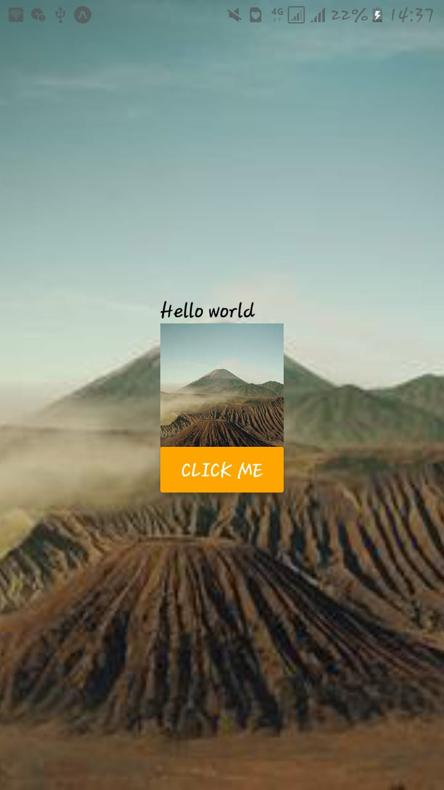
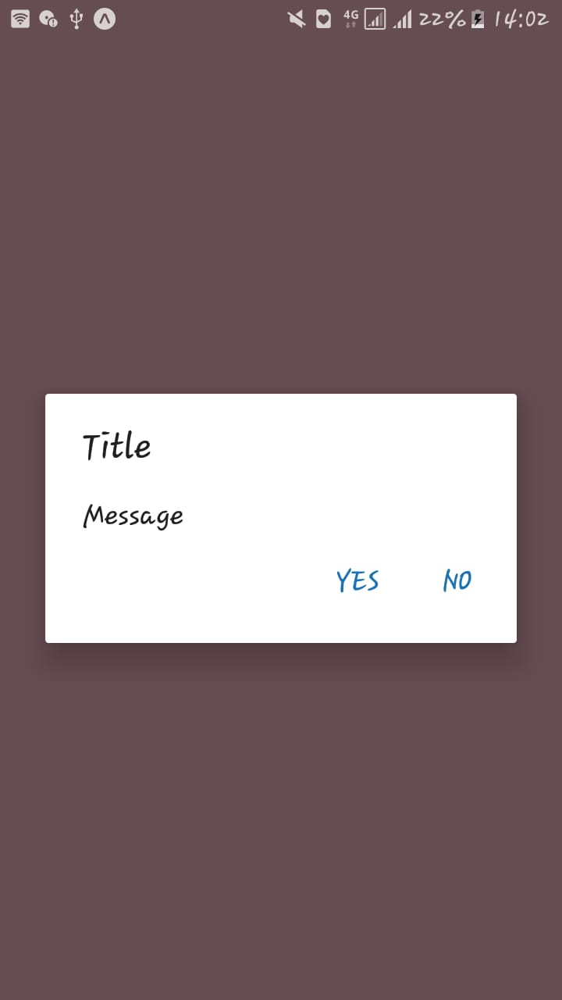

"# NativePractice"

## React Natie for beginner

## Installtion

Install [node](https://nodejs.org/en/) to install Node.
Install [android studio](https://developer.android.com/studio/) to install android studio (if you are using Emmulator/Simuator).
Install Expo Go app in your physical mobile (if you are using Expo)
Watch this video to start from beginnig[Youtube](https://www.youtube.com/watch?v=0-S5a0eXPoc&feature=emb_title)

## Conclution

After this article you will be able to perform basic things about react natiive how react native and how to implement on it.

## Screenshots

